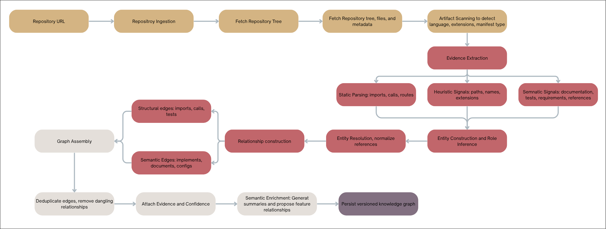

# Cascade — Part 1: Knowledge Graph Builder

> Band of Agents Hackathon submission. Part 1 of [Cascade](../docs/PRD.md), a change-impact-analysis
> system. This app turns a public GitHub repository into a parsable, queryable **knowledge graph**
> (typed nodes + structural edges) that downstream Cascade agents read from.

Paste a public GitHub repo URL → Cascade ingests it, classifies every artifact into 10 buckets using
multi-signal inference (not folder names), builds structural edges, optionally enriches with an LLM,
and renders the result as readable per-bucket sections plus an interactive node-edge graph.

## Quick start

```bash
npm install
cp .env.example .env     # optional: add GITHUB_TOKEN and/or OPENAI_API_KEY
npm run dev              # http://localhost:3000
```

Then paste a public GitHub URL (e.g. `https://github.com/docker/getting-started-todo-app`) and
click Analyze.

## Environment

| Var | Required | Purpose |
|-----|----------|---------|
| `GITHUB_TOKEN` | No | Raises GitHub API rate limits during ingestion. |
| `OPENAI_API_KEY` | No | Enables the LLM enrichment stage. Without it, you still get a complete deterministic graph. |

## Scripts

| Command | What it does |
|---------|--------------|
| `npm run dev` | Start the dev server. |
| `npm run build` | Production build. |
| `npm start` | Serve the production build. |
| `npm test` | Run the Vitest suite (125 tests; no network, no API key). |
| `npm run typecheck` | `tsc --noEmit` (strict). |
| `npm run lint` | `next lint`. |

## How it works



The full pipeline lives in [`lib/kg/`](lib/kg) and is the only part of the codebase that builds the
graph. Entry point: `runPipeline(repoUrl)` (exported from `@/lib/kg`).

```
ingest (GitHub tree+blobs) → scan → classify (signals) → tree-sitter parse
→ layer inference → structural edges → integrity review → [LLM enrich] → persist graph.json
```

The graph is the source of truth; the UI is only a view of it. Persisted graphs land in
[`graphs/`](graphs) as `*.graph.json` and are queryable via `/api/graph`, `/api/buckets`,
`/api/node/[id]`, and `/api/query`.

## Architecture, conventions & gotchas

**Important constraint:** `web-tree-sitter` is pinned to **`0.22.6`** — do not bump it. The grammars
in `tree-sitter-wasms@0.1.13` use the old WASM ABI; newer runtimes reject them and every parse
returns `null`, producing zero graph edges.

## Deploy

Targets Vercel (single Next.js unit; UI + API routes together; serverless-safe GitHub-API ingestion,
no `git clone`). The graph `store` (`lib/kg/graph/store.ts`) writes JSON locally and is designed to
swap to a database at deploy without touching callers.
